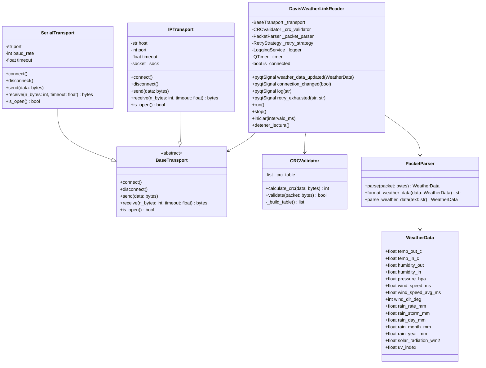
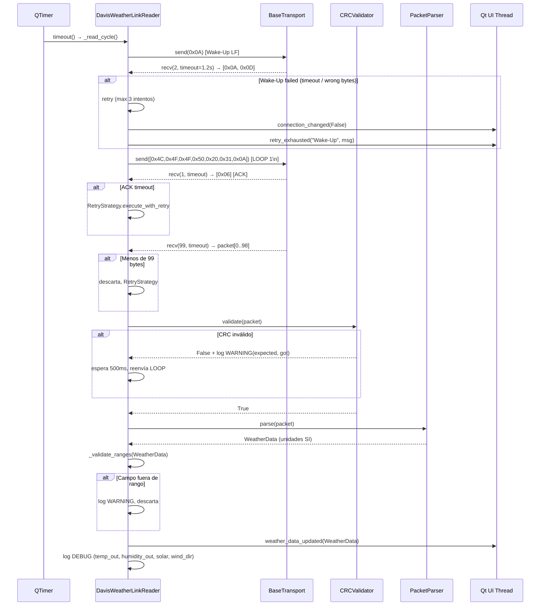

# Documento de Diseño Técnico: Davis WeatherLink Reader

## Visión General

El módulo `DavisWeatherLinkReader` integra la lectura de una estación meteorológica **Davis Vantage Pro2** en Nexo Solar. Sigue exactamente los mismos patrones arquitectónicos que `ModbusClient`: hilo `QThread` dedicado para I/O no bloqueante, señales Qt para comunicación con la UI, singletons `LoggingService` y `ConfigurationManager`, y `RetryStrategy` para reintentos con backoff exponencial.

El módulo se ubica en `modbuspython/data_access/` para mantener coherencia con la capa de acceso a datos existente, y expone la misma interfaz de señales Qt que `ModbusClient` para facilitar su integración en la UI.

---

## Arquitectura

### Posición en la arquitectura Nexo Solar

```
┌─────────────────────────────────────────────────────────┐
│                    UI Layer (PyQt6)                      │
│              WebDashboard / QML / Widgets                │
└───────────────────────┬─────────────────────────────────┘
                        │ pyqtSignal (Qt cross-thread)
┌───────────────────────▼─────────────────────────────────┐
│                  Backend Layer                           │
│      AngleStateManager  │  ValidationService            │
└───────────────────────┬─────────────────────────────────┘
                        │
┌───────────────────────▼─────────────────────────────────┐
│               Data Access Layer                          │
│  ModbusClient (QThread)  │  DavisWeatherLinkReader       │
│                          │        (QThread)  ← NEW       │
│  RetryStrategy  │  LoggingService  │  ConfigurationManager│
└───────────────────────┬─────────────────────────────────┘
                        │ Serial / TCP
┌───────────────────────▼─────────────────────────────────┐
│              Transport Layer (NEW)                       │
│      SerialTransport     │      IPTransport              │
└───────────────────────┬─────────────────────────────────┘
                        │
             Davis Vantage Pro2 Console
```

El `DavisWeatherLinkReader` vive en la misma capa que `ModbusClient` y sigue el mismo ciclo de vida: se instancia en `MainWindow`, se arranca con `start()` (herencia de `QThread`) y se detiene con `stop()`.

---

## Componentes e Interfaces

### Diagrama de componentes



---

## Capa de Transporte

### Interfaz abstracta `BaseTransport`

```python
from abc import ABC, abstractmethod

class BaseTransport(ABC):
    """Abstracción de transporte para el protocolo Davis WeatherLink."""

    @abstractmethod
    def connect(self) -> None:
        """Establece la conexión. Lanza DavisTransportError si falla."""

    @abstractmethod
    def disconnect(self) -> None:
        """Cierra la conexión y libera recursos."""

    @abstractmethod
    def send(self, data: bytes) -> None:
        """Envía bytes. Lanza DavisTransportError si falla."""

    @abstractmethod
    def receive(self, n_bytes: int, timeout: float) -> bytes:
        """Lee exactamente n_bytes. Lanza DavisTransportError si timeout o error."""

    @abstractmethod
    def is_open(self) -> bool:
        """Devuelve True si el transporte está conectado y operativo."""
```

### `SerialTransport`

Implementa `BaseTransport` sobre `pyserial`. Parámetros UART fijos: 19200 bps, 8N1, sin control de flujo. El `timeout` de lectura se configura en cada llamada a `receive()` usando `serial.timeout`.

```python
class SerialTransport(BaseTransport):
    def __init__(self, port: str, baud_rate: int = 19200, timeout: float = 5.0):
        self._port = port
        self._baud_rate = baud_rate
        self._timeout = timeout
        self._serial: Optional[serial.Serial] = None
```

### `IPTransport`

Implementa `BaseTransport` sobre `socket` TCP estándar. El socket se crea con `socket.SOCK_STREAM` y se configura con `settimeout()` para respetar el timeout configurado. El protocolo Davis sobre IP es idéntico al serie — mismos bytes, misma secuencia.

```python
class IPTransport(BaseTransport):
    def __init__(self, host: str, port: int, timeout: float = 5.0):
        self._host = host
        self._port = port
        self._timeout = timeout
        self._sock: Optional[socket.socket] = None
```

### Factory de transporte

`DavisWeatherLinkReader` construye el transporte correcto según `config_manager.get("davis_weatherlink.transport")`:

```python
def _build_transport(self) -> BaseTransport:
    transport_type = self._config.get("davis_weatherlink.transport", "serial")
    if transport_type == "serial":
        return SerialTransport(
            port=self._config.get("davis_weatherlink.serial_port", "/dev/ttyUSB0"),
            baud_rate=self._config.get("davis_weatherlink.baud_rate", 19200),
            timeout=self._config.get("davis_weatherlink.timeout", 5.0),
        )
    elif transport_type == "ip":
        return IPTransport(
            host=self._config.get("davis_weatherlink.ip_host", ""),
            port=self._config.get("davis_weatherlink.ip_port", 22222),
            timeout=self._config.get("davis_weatherlink.timeout", 5.0),
        )
    else:
        raise DavisConnectionError(
            f"Tipo de transporte no soportado: {transport_type}",
            details={"transport": transport_type}
        )
```

---

## Modelos de Datos

### `WeatherData`

Dataclass con todos los campos ya en unidades SI, listos para emitir. Los campos de lluvia usan `mm`, temperatura `°C`, velocidad `m/s`, presión `hPa`.

```python
from dataclasses import dataclass

@dataclass
class WeatherData:
    # Temperatura (°C)
    temp_out_c: float        # temperatura exterior
    temp_in_c: float         # temperatura interior

    # Humedad (% RH)
    humidity_out: float      # humedad exterior
    humidity_in: float       # humedad interior (uint8, sin conversión)

    # Presión (hPa)
    pressure_hpa: float      # presión barométrica

    # Viento
    wind_speed_ms: float     # velocidad actual (m/s)
    wind_speed_avg_ms: float # media 10 min (m/s)
    wind_dir_deg: int        # dirección (0-360 grados)

    # Lluvia (mm)
    rain_rate_mm: float      # tasa (clicks/hora → mm, factor según estación)
    rain_storm_mm: float     # lluvia de tormenta
    rain_day_mm: float       # lluvia del día
    rain_month_mm: float     # lluvia del mes
    rain_year_mm: float      # lluvia del año

    # Radiación / UV (sin conversión, ya en SI)
    solar_radiation_wm2: float  # radiación solar (W/m²)
    uv_index: float             # índice UV (adimensional)
```

### Offsets del LOOP_Packet (99 bytes, índice base 0)

| Campo | Offset(s) | Tipo | Factor | Unidad salida |
|---|---|---|---|---|
| Firma `LOO` | 1–3 | bytes | — | verificación |
| Presión barométrica | 7–8 | uint16 LE | ÷1000 → ×33.8639 | hPa |
| Temperatura interior | 9–10 | int16 LE | ÷10 → °F→°C | °C |
| Humedad interior | 11 | uint8 | — | % RH |
| Temperatura exterior | 12–13 | int16 LE | ÷10 → °F→°C | °C |
| Velocidad viento actual | 14 | uint8 | ×0.44704 | m/s |
| Velocidad viento media 10m | 15 | uint8 | ×0.44704 | m/s |
| Dirección viento | 16–17 | uint16 LE | — | grados |
| Humedad exterior | 33 | uint8 | — | % RH |
| Tasa lluvia | 41–42 | uint16 LE | clicks×25.4/100 | mm |
| Índice UV | 43 | uint8 | ÷10 | índice UV |
| Radiación solar | 44–45 | uint16 LE | — | W/m² |
| Lluvia tormenta | 46–47 | uint16 LE | ÷100×25.4 | mm |
| Lluvia día | 50–51 | uint16 LE | ÷100×25.4 | mm |
| Lluvia mes | 52–53 | uint16 LE | ÷100×25.4 | mm |
| Lluvia año | 54–55 | uint16 LE | ÷100×25.4 | mm |
| CRC | 97–98 | uint16 BE | — | validación |

### Conversiones de unidades aplicadas en `PacketParser.parse()`

```
°C = (°F − 32) × 5/9
hPa = inHg × 33.8639
m/s = mph × 0.44704
mm  = inches × 25.4
```

---

## Algoritmo CRC-16 CCITT

El protocolo Davis usa CRC-16 CCITT con polinomio **0x1021**, valor inicial **0x0000**, sin reflexión de bits (big-endian). Se implementa con tabla de lookup de 256 entradas para máxima eficiencia.

### Construcción de la tabla de lookup

```python
CRC_POLY = 0x1021

def _build_crc_table() -> list:
    table = []
    for i in range(256):
        crc = i << 8
        for _ in range(8):
            if crc & 0x8000:
                crc = ((crc << 1) ^ CRC_POLY) & 0xFFFF
            else:
                crc = (crc << 1) & 0xFFFF
        table.append(crc)
    return table
```

### Cálculo del CRC sobre un buffer

```python
def calculate_crc(self, data: bytes) -> int:
    crc = 0x0000
    for byte in data:
        crc = ((crc << 8) ^ self._crc_table[(crc >> 8) ^ byte]) & 0xFFFF
    return crc
```

### Validación del paquete

```python
def validate(self, packet: bytes) -> bool:
    # Bytes 0–96: datos; bytes 97–98: CRC Big Endian
    computed = self.calculate_crc(packet[:97])
    stored = (packet[97] << 8) | packet[98]
    return computed == stored
```

---

## Flujo de Secuencia Completo



---

## Integración con Singletons Existentes

### LoggingService

`DavisWeatherLinkReader` usa el singleton `LoggingService()` para todos los mensajes, igual que `ModbusClient`. No se instancia ningún logger alternativo.

| Evento | Nivel |
|---|---|
| Conexión establecida / perdida | INFO |
| Wake-Up completado con éxito | DEBUG |
| CRC inválido (con valores esperado/calculado) | WARNING |
| Firma LOO incorrecta | WARNING |
| Campo WeatherData fuera de rango | WARNING |
| Inicio/detención de lectura periódica | INFO |
| Campos clave de WeatherData decodificados | DEBUG |
| Error de puerto serie / timeout ACK | ERROR |
| Intento de reintento exitoso (intento > 1) | INFO |

### ConfigurationManager

Acceso exclusivo a través de `config_manager.get("davis_weatherlink.<key>")`. Nunca accede directamente a `config.yaml`.

```python
poll_ms = config_manager.get("davis_weatherlink.poll_interval_ms", 5000)
transport_type = config_manager.get("davis_weatherlink.transport", "serial")
retry_attempts = config_manager.get("davis_weatherlink.retry_attempts", 3)
retry_backoff = config_manager.get("davis_weatherlink.retry_backoff", 1.0)
timeout = config_manager.get("davis_weatherlink.timeout", 5.0)
```

### RetryStrategy

Se instancia en `__init__` con parámetros leídos desde `ConfigurationManager`, igual que en `ModbusClient`:

```python
self._retry_strategy = RetryStrategy(
    max_attempts=retry_attempts,
    initial_delay=retry_backoff,
    backoff_factor=2.0,
    max_delay=30.0,
)
```

Las operaciones que se envuelven con `execute_with_retry` son: `_wake_up()`, `_send_loop_command()`, `_read_packet()`.

---

## Señales Qt de `DavisWeatherLinkReader`

Mismo contrato que `ModbusClient` para facilitar la integración en la UI:

```python
class DavisWeatherLinkReader(QThread):
    weather_data_updated = pyqtSignal(WeatherData)  # datos meteorológicos decodificados
    connection_changed   = pyqtSignal(bool)          # estado de conexión
    log                  = pyqtSignal(str)           # mensajes de log para la UI
    retry_exhausted      = pyqtSignal(str, str)      # (operación, mensaje_error)
```

| Señal | Cuándo se emite |
|---|---|
| `weather_data_updated(WeatherData)` | LOOP_Packet decodificado y validado con éxito |
| `connection_changed(True)` | Wake-Up completado con éxito |
| `connection_changed(False)` | Error de transporte o Wake-Up fallido |
| `log(str)` | Eventos relevantes para mostrar en la UI |
| `retry_exhausted(op, msg)` | `RetryStrategy` agota todos los intentos |

---

## Estructura de Ficheros Propuesta

```
modbuspython/
└── data_access/
    ├── davis_weatherlink/
    │   ├── __init__.py
    │   ├── davis_reader.py          # DavisWeatherLinkReader (QThread)
    │   ├── transport.py             # BaseTransport, SerialTransport, IPTransport
    │   ├── crc_validator.py         # CRCValidator
    │   ├── packet_parser.py         # PacketParser
    │   └── weather_data.py          # WeatherData (dataclass)
    ├── modbus_client.py             # existente
    ├── modbus_connection.py         # existente
    ├── retry_strategy.py            # existente
    └── logging_service.py           # existente
```

---

## Extensión de `config.yaml`

Añadir al final del fichero la siguiente sección:

```yaml
davis_weatherlink:
  transport: serial            # "serial" o "ip"
  serial_port: /dev/ttyUSB0   # COM3 en Windows
  baud_rate: 19200             # fijo por protocolo Davis
  ip_host: 192.168.1.200       # solo si transport: ip
  ip_port: 22222               # puerto WeatherLink IP por defecto
  poll_interval_ms: 5000       # intervalo de lectura periódica
  timeout: 5.0                 # timeout en segundos
  retry_attempts: 3
  retry_backoff: 1.0
```

`ConfigurationManager` valida que `baud_rate == 19200` y que `transport` sea `serial` o `ip`. Si alguna validación falla, registra un error y usa el valor por defecto correspondiente (requisito 13.3).

---

## Excepciones Nuevas en `exceptions.py`

Se añaden tres excepciones a la jerarquía existente, todas heredando de `NexoSolarException`:

```python
class DavisConnectionError(NexoSolarException):
    """
    Fallo al establecer o mantener la conexión con la consola Davis.

    Ejemplos:
        - No se puede abrir el puerto serie
        - Wake-Up sin respuesta después de 3 intentos
        - Conexión TCP perdida durante lectura
    """
    pass


class DavisProtocolError(NexoSolarException):
    """
    Violación del protocolo Davis WeatherLink.

    Ejemplos:
        - CRC inválido en LOOP_Packet
        - Firma LOO incorrecta en paquete
        - ACK no recibido tras comando LOOP
        - Paquete con menos de 99 bytes
    """
    pass


class DavisTransportError(NexoSolarException):
    """
    Error en la capa de transporte (serie o IP).

    Ejemplos:
        - pyserial SerialException al leer/escribir
        - socket.timeout al esperar datos
        - socket.error al enviar comando
    """
    pass
```

La jerarquía queda:

```
NexoSolarException
├── ConfigurationError
├── ValidationError
├── ModbusConnectionError
├── ModbusOperationError
├── DatabaseError
├── MigrationError
├── DavisConnectionError   ← NEW
├── DavisProtocolError     ← NEW
└── DavisTransportError    ← NEW
```

---

## Manejo de Errores

| Condición | Excepción lanzada | Acción |
|---|---|---|
| Puerto serie no disponible | `DavisTransportError` | Log ERROR + `connection_changed(False)` |
| Conexión TCP fallida | `DavisConnectionError` | `RetryStrategy` + `retry_exhausted` si agota |
| Wake-Up sin respuesta (3 intentos) | `DavisConnectionError` | `retry_exhausted("Wake-Up", msg)` |
| ACK timeout | `DavisProtocolError` | `RetryStrategy` |
| Paquete < 99 bytes | `DavisProtocolError` | Descarta + `RetryStrategy` |
| CRC inválido | `DavisProtocolError` | Descarta + espera 500ms + reenvía LOOP |
| Firma LOO incorrecta | `DavisProtocolError` | Descarta + log WARNING |
| Campo WeatherData fuera de rango | — (no excepción) | Descarta WeatherData + log WARNING |
| `RetryStrategy` agota reintentos | — | `retry_exhausted(op, msg)` + estado seguro |

El estado seguro (`safe_state = True`) impide emitir `weather_data_updated` hasta que el operador solicite reconexión manual o el hilo se reinicia. El método `stop()` siempre responde, incluso en estado de error.

---

## Propiedades de Corrección

*Una propiedad es una característica o comportamiento que debe ser cierto en todas las ejecuciones válidas del sistema — esencialmente, una afirmación formal sobre lo que el sistema debe hacer. Las propiedades sirven como puente entre especificaciones legibles por humanos y garantías de corrección verificables automáticamente.*

### Propiedad 1: CRC — round-trip (paquete construido con CRC correcto siempre válida)

*Para todo* buffer de 97 bytes arbitrario, si se calcula su CRC-16 CCITT con `CRCValidator.calculate_crc()` y se añade en los bytes 97–98 en formato Big Endian, entonces `CRCValidator.validate()` sobre el paquete resultante de 99 bytes debe devolver `True`.

**Validates: Requirements 4.1, 4.2, 4.3, 4.5**

### Propiedad 2: CRC — rechazo de paquetes con CRC modificado

*Para todo* paquete LOOP de 99 bytes con CRC válido, si se modifica cualquier byte (incluidos los bytes 97–98) de forma que el CRC deje de coincidir, `CRCValidator.validate()` debe devolver `False`.

**Validates: Requirements 4.4**

### Propiedad 3: Round-trip de conversión de temperatura

*Para todo* valor de temperatura en °F en el rango representable por el sensor Davis (−200 °F a 300 °F), aplicar la conversión °F → °C y luego la inversa °C → °F debe producir el valor original con una tolerancia máxima de ±0.01 °F.

**Validates: Requirements 9.1, 9.6**

### Propiedad 4: Parsing con conversiones correctas

*Para todo* paquete LOOP de 99 bytes sintético construido con valores conocidos (temperatura, presión, velocidad, lluvia), `PacketParser.parse()` debe producir un `WeatherData` cuyos campos en unidades SI corresponden exactamente a la aplicación de los factores de conversión especificados sobre los valores raw del paquete.

**Validates: Requirements 5.1, 5.2, 9.1, 9.2, 9.3, 9.4**

### Propiedad 5: Validación de rangos de WeatherData

*Para todo* `WeatherData` en el que alguno de los campos supervisados (presión en hPa, temperatura exterior en °C, humedad exterior en % RH, velocidad de viento en m/s, dirección de viento en grados) está fuera de su rango válido definido en los requisitos, `DavisWeatherLinkReader` no debe emitir la señal `weather_data_updated`.

**Validates: Requirements 11.1, 11.2, 11.3, 11.4, 11.5, 11.6**

### Propiedad 6: Round-trip de serialización de WeatherData

*Para toda* estructura `WeatherData` válida (campos dentro de rangos), aplicar `PacketParser.format_weather_data()` seguido de `PacketParser.parse_weather_data()` debe producir una estructura `WeatherData` equivalente a la original (mismos valores en todos los campos, dentro de la precisión de representación de texto).

**Validates: Requirements 5.4, 5.5**

### Propiedad 7: Transparencia del transporte

*Para todo* payload de bytes del protocolo Davis (Wake-Up, LOOP_Packet), el `WeatherData` resultante emitido por `DavisWeatherLinkReader` debe ser idéntico independientemente de si el payload se entrega a través de `SerialTransport` o `IPTransport`.

**Validates: Requirements 10.2, 10.5**

### Propiedad 8: Rechazo de paquetes con firma LOO inválida

*Para todo* buffer de 99 bytes cuyos bytes 1–3 no sean `[0x4C, 0x4F, 0x4F]`, `PacketParser.parse()` debe rechazar el paquete y no producir ningún `WeatherData`.

**Validates: Requirements 5.3**

---

## Estrategia de Testing

### Enfoque dual (unit + property-based)

Los tests de unidad verifican ejemplos concretos, casos extremos y condiciones de error. Los tests de propiedad verifican invariantes universales sobre rangos amplios de inputs generados. Ambos son complementarios y necesarios.

### Tests de unidad

Se centran en:
- Construcción correcta del tabla CRC-16 CCITT (verificación contra valores de referencia del manual Davis)
- Decodificación de un LOOP_Packet de referencia con valores conocidos
- Conversión de unidades con casos concretos (ej. 32°F = 0°C, 0 mph = 0 m/s)
- Comportamiento con firma LOO incorrecta
- Comportamiento de `stop()` en estado de error (sin transporte activo)
- Configuración correcta con `transport: serial` y `transport: ip`

### Tests de propiedad (Hypothesis)

Se usa la librería **Hypothesis** (ya presente en el proyecto, ver `.hypothesis/`), con mínimo **100 iteraciones** por propiedad.

Cada test de propiedad lleva un comentario con el tag:
```
# Feature: davis-weatherlink-reader, Property N: <texto>
```

| Propiedad | Test Hypothesis | Generadores |
|---|---|---|
| P1: CRC round-trip | `@given(st.binary(min_size=97, max_size=97))` — construir paquete con CRC correcto, verificar validate()==True | bytes arbitrarios |
| P2: CRC rechazo | `@given(st.binary(min_size=99, max_size=99))` — modificar un byte del CRC, verificar validate()==False | paquetes con CRC corrupto |
| P3: Round-trip temperatura | `@given(st.floats(min_value=-200, max_value=300))` — °F→°C→°F ±0.01 | floats en rango °F |
| P4: Parsing con conversiones | `@given(...)` — construir paquete sintético con valores conocidos, verificar campos SI | valores raw en rangos del sensor |
| P5: Validación rangos | `@given(builds(WeatherData, ...))` con un campo fuera de rango — no emite señal | WeatherData con campos extremos |
| P6: Round-trip WeatherData | `@given(builds(WeatherData, ...))` con campos válidos — format → parse produce equivalente | WeatherData arbitrarios válidos |
| P7: Transparencia transporte | mock serial + mock IP con mismos bytes — mismo WeatherData emitido | payloads de 99 bytes |
| P8: Firma inválida | `@given(st.binary(min_size=99, max_size=99))` con bytes 1-3 ≠ [0x4C,0x4F,0x4F] | paquetes con firma incorrecta |

### Configuración mínima de Hypothesis

```python
from hypothesis import given, settings, HealthCheck
from hypothesis import strategies as st

@settings(max_examples=100, suppress_health_check=[HealthCheck.too_slow])
@given(...)
def test_property_N(...):
    # Feature: davis-weatherlink-reader, Property N: <texto>
    ...
```

### Estructura de ficheros de test

```
tests/
└── test_davis_weatherlink/
    ├── test_crc_validator.py      # unit + Properties 1, 2
    ├── test_packet_parser.py      # unit + Properties 4, 6, 8
    ├── test_unit_conversion.py    # unit + Property 3
    ├── test_weather_data.py       # unit + Property 5
    └── test_transport.py          # unit + Property 7
```
